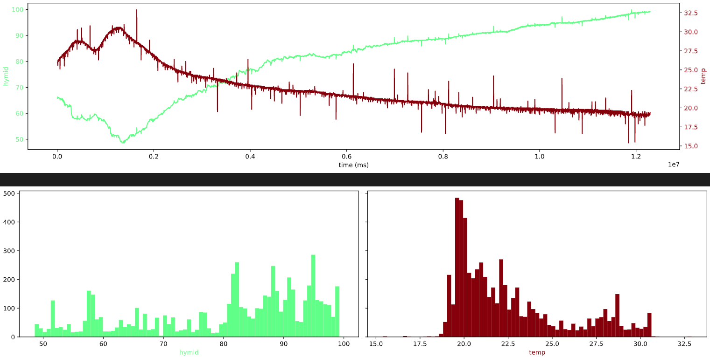

# Arduino_serial_logger_fraemwork
### Set of Python classes to construct systems for automatic connect to Arduino board and data logging.

### The Serial Data Logger(class SerialDataLogger) allows the following:

1) Automatically finds the correct COM port and connect to Arduino.
2) Records the response from Arduino and make it available for processing functions
3) Can run in emulate mode, allowing the emulation of Arduino responses based on previously recorded files.
This option is useful and convenient for testing purposes, as it allows for testing of the end application without a permanent connection to the Arduino board

### All of these functions will be performed in a separate process, <>so as not to block the main application's processing.

